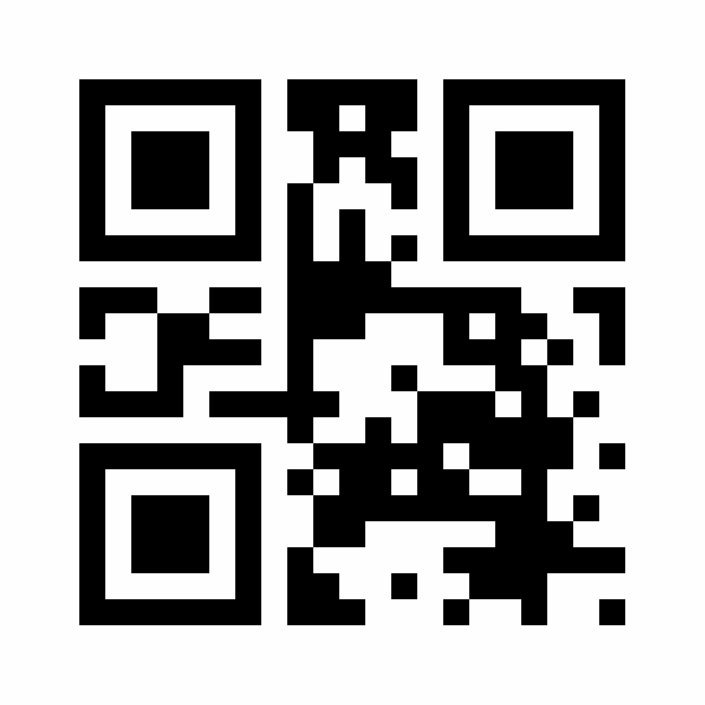

# 1-Headings
How to give headings in markdown files?

# Heading 1
## Heading 2
### Heading 3
#### Heading 4
##### Heading 5
###### Heading 6

# 2-Block of words
This is a normal text in markdown.

> This is a block of special text
> This is a second line


> This is a block of special text
>  
> This is a second line

# 3-Line break
This is a 40 days long course Data Science with Python.\
This is a second line

This is a 40 days long course Data Science with Python.

This is a second line


# 4-Combine two things
Block of words and heading

> ## Heading 2

# 5- Face of text

**Bold**

*Italic*


***Bold and Italic***


or you can use these symbols 

__Bold__

_Italic_


# 6- Bullet points/ Lists

- Day-1
- Day-2
- Day-3
- Day-4
- Day-5
   - Day-5a
    - Day-5b

- Day-6
- Day-7
- Day-8
- Day-9
- Day-10

> __Using *or+__

* Day-1

+ Day-2


> Numbering of list

1. Day-1
2. Day-2
3. Day-3
1. Day-4
   1. Day-4a
   2. Day-4b
2. Day-5
3. Day-6


# 7- Line breaks or page breaks

This is page 1.

---

___

***

This is page 2.

# 8- Links and Hyperlinks

<https://www.google.com>

[google ka link](https://www.google.com)    

[The google](https://www.google.com "Google's Homepage")

[google]: https://www.google.com

google k liye isko open karo [click here][google]

# 9- Images and Figures with link
To join this course please scan the following QR code:


[QR](qr.png)

saved picture:
[saved picture](Usman.png)


# 10- Adding code or code block
To print a string use `print("Hello World")`

`print("Hello World")`


```
x = 5+6
y = 3-2
z = x*y
```

> This code will show color according to python language syntax


```python
x = 5+6
y = 3-2
z = x*y
print(z)
```

> This code will show color according to R language syntax


```r
x = 5+6
y = 3-2
z = x*y
print(z)
```
> This code will show color according to C language syntax

```c
#include <stdio.h>
int main() {
   printf("Hello World");

   return 0;
}   
```
# 11- Adding Tables

| species | Petal_length | Sepal_length |
| :- | :-----: |------:|
|virginica|18.2|20.2|
|virginica|18.2|20.2|
|virginica|18.2|20.2|
|virginica|18.2|20.2|
|virginica|18.2|20.2|


| Name | Email |
| ---- | ----- |

| John | william.henry.harrison@example-pet-store.com |
| ---- | ----- |

| Name | Email |
| ---- | ----- |
| John | william.henry.harrison@example-pet-store.com |
| Name | Email |
| ---- | ----- |


# 12-Table of Content
[1-Headings](#1-headings)\
[2- Block of words/citation](#2-block-of-words)\
[3- line break](#3-line-break)\
[4- combine two things](#4-combine-two-things)\
[5- face of text](#5--face-of-text)\
[6- bullet points/lists](#6--bullet-points-lists)\
[7- line/page breaks](#7--line-breaks-or-page-breaks)\
[8- links and hyperlinks](#8--links-and-hyperlinks)\
[9-images and figures with links](#9--images-and-figures-with-link)\
[10- code/code block](#10--adding-code-or-code-block)\
[11- adding table](#11--adding-tables)

# 13 - Install extensions
**Sample text**\
_Sample text_\
**_Sample text_**

# Using right click
toggle hyperlink\
[Link](https://marketplace.visualstudio.com/items?itemName=VisualStudioExptTeam.vscodeintellicode)

toggle image


Toggle Strikethrough\
~~Image~~

Toogle code block\
```
Image
```
Toggle inline\
`Image`

Toggle citation\
> Image

toggle bullet points\

* Image

toggle number list\

1. Image

toggle checkboxes\

- [x] Images

Add Table
Column A | Column B | Column C
---------|----------|---------
 A1 | B1 | C1
 A2 | B2 | C2
 A3 | B3 | C3


 Add table with header

Column A | Column B | Column C
---------|----------|---------
 A1 | B1 | C1
 A2 | B2 | C2
 A3 | B3 | C3